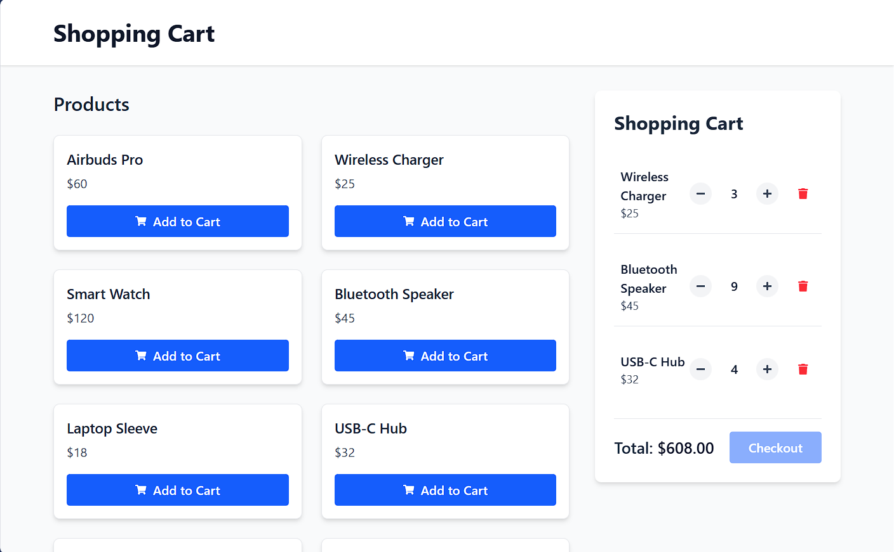

# Shopping Cart - React.js + Tailwind CSS

A modern, fully-featured shopping cart implementation built with React, Tailwind CSS, and Vite. This project demonstrates a complete cart system with persistent local storage, cross‑tab synchronization, and a reusable custom hook – perfect for e‑commerce applications or as a learning resource.

## preview

## Features
- **Add to Cart** – Add products with a single click; duplicate products increment quantity.

- **Remove from Cart** – Remove items entirely.

- **Update Quantity** – Increase/decrease quantity with +/- buttons (minimum quantity 1).

- **Real‑time Total Calculation** – Automatically computes the total price using useMemo.

- **Local Storage Persistence** – Cart state is automatically saved and restored.

- **Cross‑tab Synchronization** – Cart updates are reflected across all open browser tabs.

- **Custom Hook** – Encapsulated cart logic in useCart for clean, reusable code.

- **Responsive UI** – Tailwind CSS ensures a mobile‑friendly, modern design.

- **Component‑Based Architecture** – Separated concerns: ProductCard, CartItem, Cart, and App.


## Tech Stack
- React 19
- Tailwind CSS 4
- Vite
- react-icons
- localstorage api
- custom hooks

## Getting Started
- Bun
### Installation
1. Clone the repo
```bash
git https://github.com/Pranto-Paul/shopping-cart
cd shopping-cart
```
2. Install dependencies:
```bash
bun install
```
3. Start the development server
```bash
bun run dev
```
4. Open *http://localhost:5173* to view the application.

## Project structure
```text
src/
├── assets/               # Static assets (images, etc.)
├── components/
│   ├── Cart.jsx          # Cart container with checkout button
│   ├── CartItem.jsx      # Individual cart row with quantity controls
│   └── ProductCard.jsx   # Product display and add-to-cart button
├── data/
│   └── index.js          # Sample products array
├── hooks/
│   └── useCart.js        # Custom hook with all cart logic
├── App.jsx               # Main application layout
├── main.jsx              # Entry point
└── index.css             # Tailwind imports
```
## Key Components
### ***ProductCard***
Displays product information and an Add to Cart button. Clicking the button calls addToCart from the custom hook.

### ***CartItem***
Renders a single cart entry with product name, price, quantity controls, and a remove button. Disables the decrement button when quantity is one.

### ***Cart***
Shows the list of cart items, the total price, and a disabled checkout button (for demo purposes). Displays an empty‑state message when no items are present.

### ***App***
Arranges products and cart side‑by‑side on large screens (stacked on mobile). Uses the useCart hook to manage global cart state.

## Custom Hook: useCart
The **useCart** hook encapsulates all cart‑related logic and state, making it easy to reuse across components.

## Local Storage & Cross‑tab Synchronization
### ***Persistence***
The hook initialises cart by reading from **localStorage** (key: **'cart'**). A **useEffect** watches **cart** and writes updates back to **localStorage**. Error handling prevents crashes from corrupted data.

### ***Cross‑tab Updates***
Another **useEffect** attaches a storage event listener. When **localStorage** changes in a different tab, the new value is parsed and merged into the current state. This keeps all tabs in sync without manual refresh.

## Sample Products
The demo includes ten sample products stored in *src/data/index.js*:
```javascript
export const products = [
  { id: 1, name: "Airbuds Pro", price: 60 },
  { id: 2, name: "Wireless Charger", price: 25 },
  { id: 3, name: "Smart Watch", price: 120 },
  { id: 4, name: "Bluetooth Speaker", price: 45 },
  { id: 5, name: "Laptop Sleeve", price: 18 },
  { id: 6, name: "USB-C Hub", price: 32 },
  { id: 7, name: "Gaming Mouse", price: 40 },
  { id: 8, name: "Mechanical Keyboard", price: 85 },
  { id: 9, name: "Monitor Stand", price: 30 },
  { id: 10, name: "Desk Lamp", price: 22 }
];
```
## License
This project is licensed under the MIT License. See the LICENSE file for details.